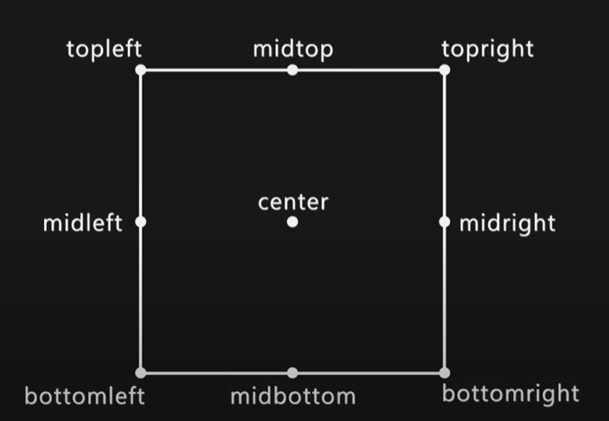
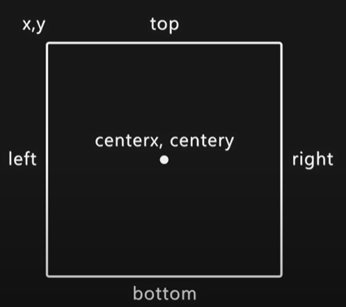

Rectangles play a crucial role in Pygame for several reasons, as they serve as a fundamental building block for creating graphical elements and managing collisions in 2D games. 
<br></br>
**Bounding Boxes:**

Rectangles define the bounding boxes of game objects, such as characters, obstacles, and items. The bounding box represents the smallest axis-aligned rectangle that fully encloses an object. 

<br></br>
**Sprite Positioning:**

In Pygame, sprites are represented by rectangular surfaces. The position and dimensions of these rectangles define the position and size of the sprites on the screen. Manipulating these rectangles allows you to control the position and movement of game elements.

X and Y coordinates(tuple)

<br></br>
Individual Coordinates (either X or Y)

<br></br>
<br></br>
**Drawing and Blitting:**
   - Rectangles are used to define areas for drawing and blitting operations. When drawing on a surface or blitting images onto the screen, rectangles specify the region where these operations occur. This helps in managing the layout of graphical elements.

     ```python
     # Example of drawing a rectangle on a surface
     pygame.draw.rect(surface, color, pygame.Rect(x, y, width, height))
     ```


<br></br>
**Efficient Drawing and Updating:**

Pygame's `pygame.Rect` class provides convenient methods for efficiently updating and redrawing portions of the screen. For example, the `rect.move_ip` method allows you to move a rectangle in place, updating its position without the need to create a new object.

     ```python
     player_rect.move_ip(dx, dy)
     ```

